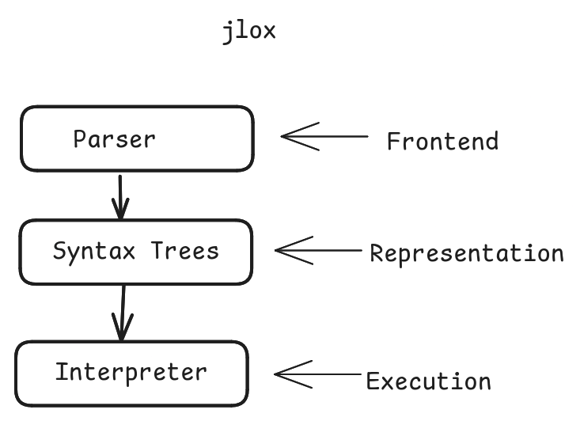

## jlox –  Lox Editor & Runner

This is a web-based code editor and runner for the [Lox language](https://craftinginterpreters.com/the-lox-language.html) from Bob Nystrom's **Crafting Interpreters** book. It allows users to write, edit, and execute Lox code directly in the browser.

> [!IMPORTANT]
> When running Lox code on the deployed site for the first time, you may experience a delay of a few seconds.

## Tech Stack
- Frontend: React, TypeScript, Vite, Monaco Editor
- Backend: Java, Spring Boot

### Backend Setup
```bash
cd backend
export FRONTEND_URL=http://localhost:5173    # for zsh shell
mvn spring-boot:run
```

### Frontend Setup
```bash
cd frontend
cp .env.example .env
npm install
npm run dev
```
## Jlox Architecture


## JLox Grammar
- [Lox Language Features](https://craftinginterpreters.com/the-lox-language.html)
```text
program        → statement* EOF ;
declaration    → classDecl
               | funDecl
               | varDecl
               | statement ;
classDecl      → "class" IDENTIFIER ( "<" IDENTIFIER )?
               "{" function* "}" ;             
                 
funDecl        → "fun" function ;
function       → IDENTIFIER "(" parameters? ")" block ;             
parameters     → IDENTIFIER ( "," IDENTIFIER )* ;
                 
varDecl        → "var" IDENTIFIER ( "=" expression )? ";" ;
statement      → exprStmt
               | forStmt
               | ifStmt
               | printStmt
               | returnStmt
               | whileStmt
               | block ;
returnStmt     → "return" expression? ";" ;
forStmt        → "for" "(" ( varDecl | exprStmt | ";" )
                 expression? ";"
                 expression? ")" statement ;
whileStmt      → "while" "(" expression ")" statement ;
ifStmt         → "if" "(" expression ")" statement
                 ( "else" statement )? ;
block          → "{" declaration* "}" ;
exprStmt       → expression ";" ;
printStmt      → "print" expression ";" ;
expression     → assignment ;
assignment     → ( call "." )? IDENTIFIER "=" assignment
               | logic_or ;
               
logic_or       → logic_and ( "or" logic_and )* ;
logic_and      → equality ( "and" equality )* ;
equality       → comparison ( ( "!=" | "==" ) comparison )* ;
comparison     → term ( ( ">" | ">=" | "<" | "<=" ) term )* ;
term           → factor ( ( "-" | "+" ) factor )* ;
factor         → unary ( ( "/" | "*" ) unary )* ;
unary          → ( "!" | "-" ) unary | call ;
call           → primary ( "(" arguments? ")" | "." IDENTIFIER )* ;
arguments      → expression ( "," expression )* ;
primary        → "true" | "false" | "nil" | "this"
               | NUMBER | STRING | IDENTIFIER | "(" expression ")"
               | "super" "." IDENTIFIER ;
```

